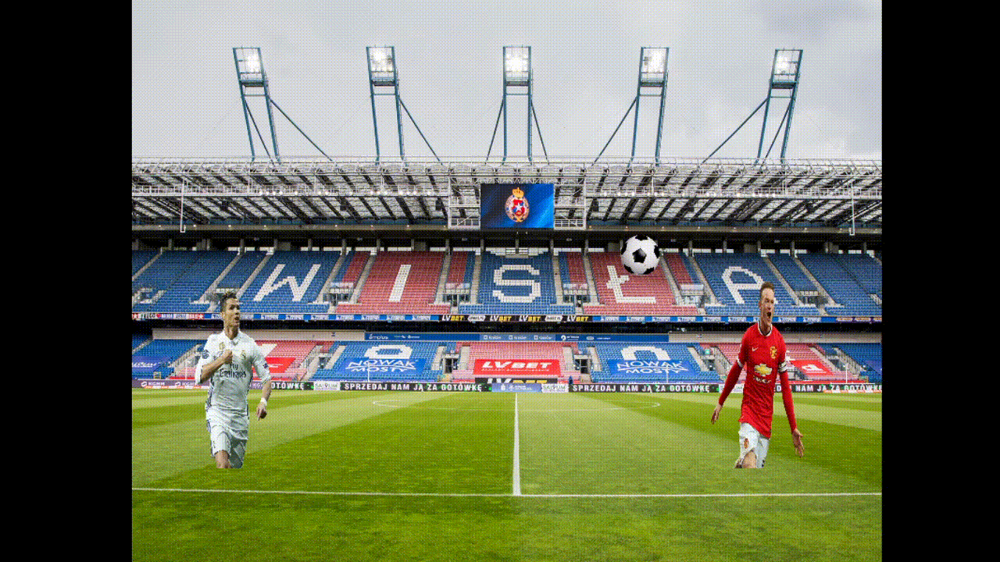

# Head_soccer_game
Game of skill that uses OpenGL API (GLFW library)

The project is based on tutorial:

https://learnopengl.com/In-Practice/2D-Game/Breakout

## Demonstration video

## Game description

The point of the game is to place a ball object in one of goals.

Two players try to place the ball in opposite-side goal using bouncing effect.

The one who scores the most wins.

## Control Keys
### Keys for Player1

| KEY    |  Move | 
| ------ |:-----:|
| A      | Left  |
| D      | Right |

### Keys for Player2

| KEY    |  Move | 
| ------ |:-----:|
| <-     | Left  |
| ->     | Right |

## Documentation
Availabe here: [Headsoccer_doc.pdf](https://github.com/thomastomcio/Head_soccer_game/blob/master/doxygen/latex/Headsoccer_doc.pdf)

## State
Under development.

## TODO
- goal objects with interaction
- scoring system
- user preferences manager and user menu
